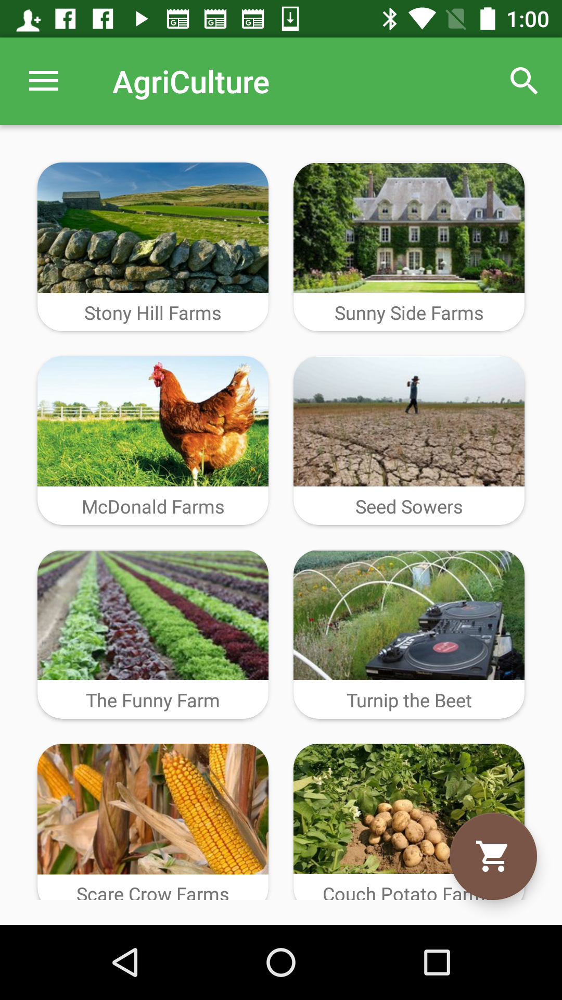
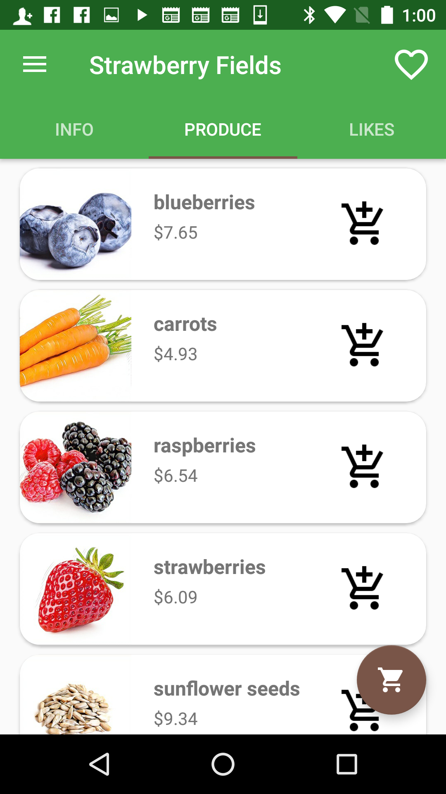
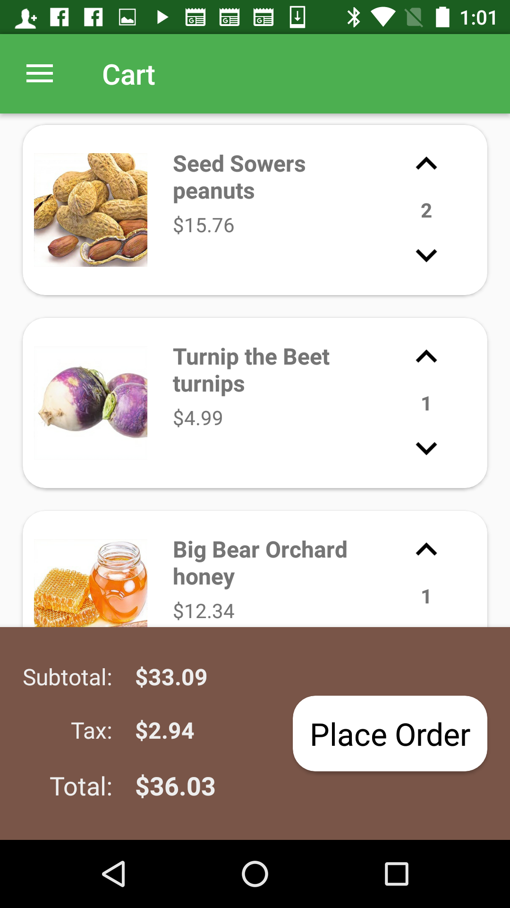
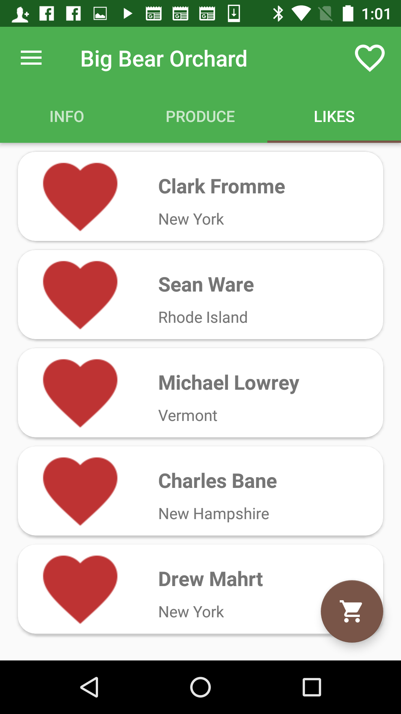

#  Project #2: Mobile Commerce App

## Overview
agriCulture is market place that connects its users directly to farms.
## Features
Users can shop for fresh produce through a list of farms. These farms are searchable by name, state, or the user can search by food. 
Once a farm is selected the user can view the farm's info including their story, specialty, and location. They can then navigate to the farm's produce list and start adding items to their cart.
It's also possible to 'like' a farm. Once liked, the user's name will be displayed on the farm's likes list.

Checkout is a straight forward process. The user can increase of decrease the quantity of each item and then place an order.
Once an order is placed, the user is brought to a list of all previous orders with the most recent one highlighted.

The user also has the option to fiew a list of all the farms they have liked. From this list they can unlike farms if they wish.

Lastly, the user can edit his or her account information from the settings navigation tab.

##Screenshots

   

   

